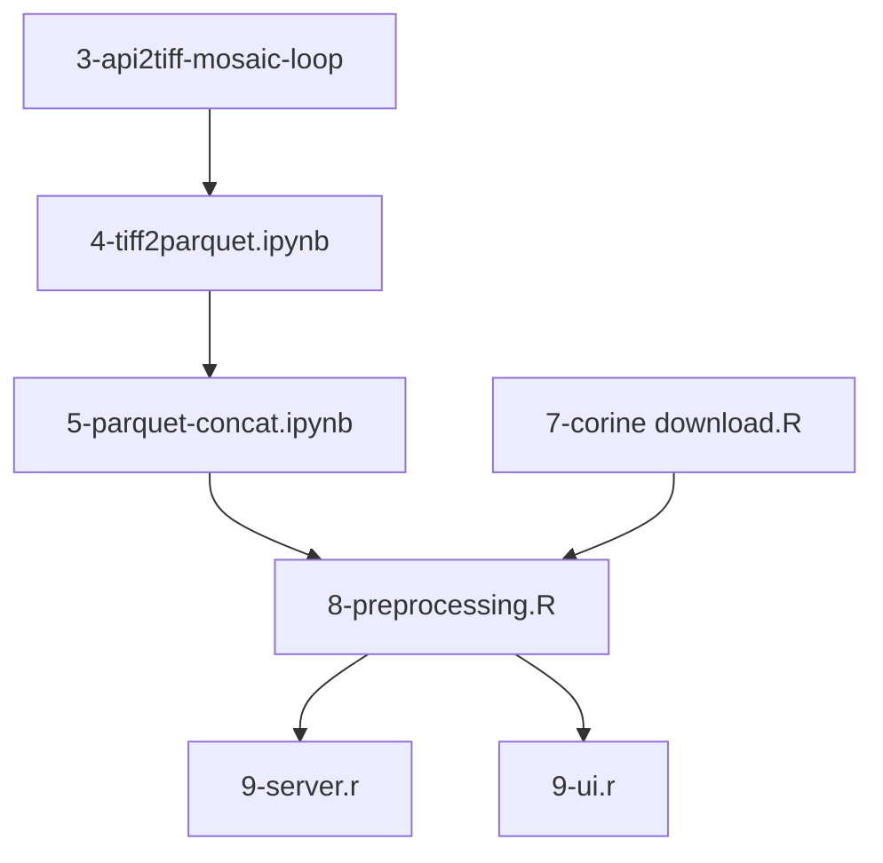

# NTTS Hackathon 2025, Statbel (Belgian NSI) team submission: Corine Land Cover Change tracker

This is an extract of the (not curated) programs produced during the Hackathon. 

## Pitching

[Pitch Link !](https://webcast.ec.europa.eu/ntts-2025-conference-mans-2025-03-10)

Statbel's presentation, by Louise, starts at 9:30. 

## Summary

Data used:
- Sentinel 2/L2A data (satellites)
- CLC (Corine Land Cover)
- NUTS (Nomenclature of Territorial Units for Statistics)

Processing:
- Grid matching
- Classification model using R/Caret (classification tree)
- Dashboarding using Shiny

## Content

Notebooks/Scripts:
- 2-catalog.ipynb: shows how to extract catalog information from Copernicus
- 3-api2tiff-mosaic-loop.ipynb: extracts satellites data from Sentinel 2/L2A and stores the results in Tiff files
- 4-tiff2parquet.ipynb: converts tiff files into parquet files; tiff files are aggegated at 100m*100m level to make it possible to link the result with Corine Land Cover
- 5-parquet2bboxes.ipynb: extracts bbox of Tiff files to make it possible to identify the Tiff file that covers given (x,y) coordinates
- 5-parquet-concat.ipynb: concatenates parquet files
- 6-extracts for QGis.ipynb: creates a csv file that can be viewed in QGis (interesting to visualise the content of databases)
- 7-corine download.R: processing of corine land cover data
- 8-preprocessing.R: modeling (decision tree with caret)
- 9-server.r: dashboarding with Shiny
- 9-ui.r: dashboarding with Shiny

## Process flow

Process flow of essential processes.

